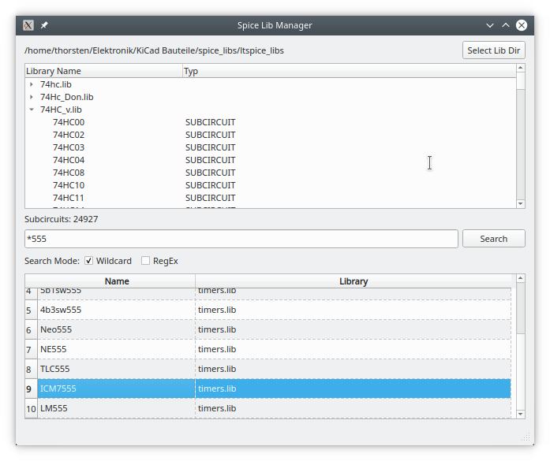

# Spice Lib Manager

### [Latest version here](https://github.com/ThKattanek/spice_lib_manager/releases/latest)

## Screenshot


## Build under Linux

### An important requirement
- qttools5-dev

### Required Libs
- qt5

### Build and installation
```bash
git clone https://github.com/ThKattanek/spice_lib_manager.git
cd spice_lib_manager
mkdir build
cd build
qmake .. PREFIX="/usr/local"
make -j8
sudo make install
```
### Deinstall
```bash
xargs rm < install_manifest.txt
```